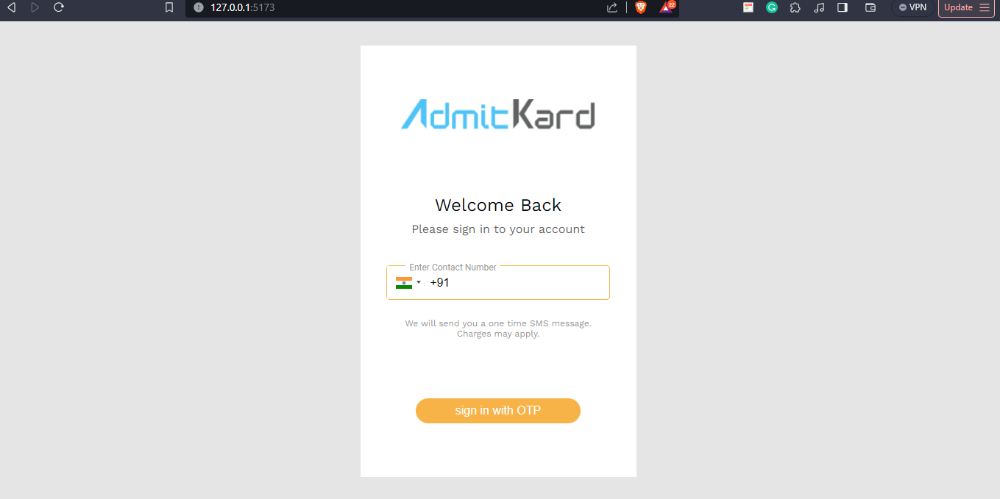
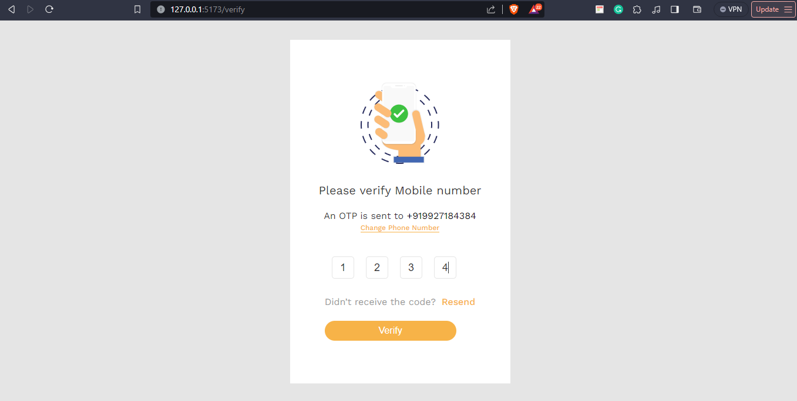
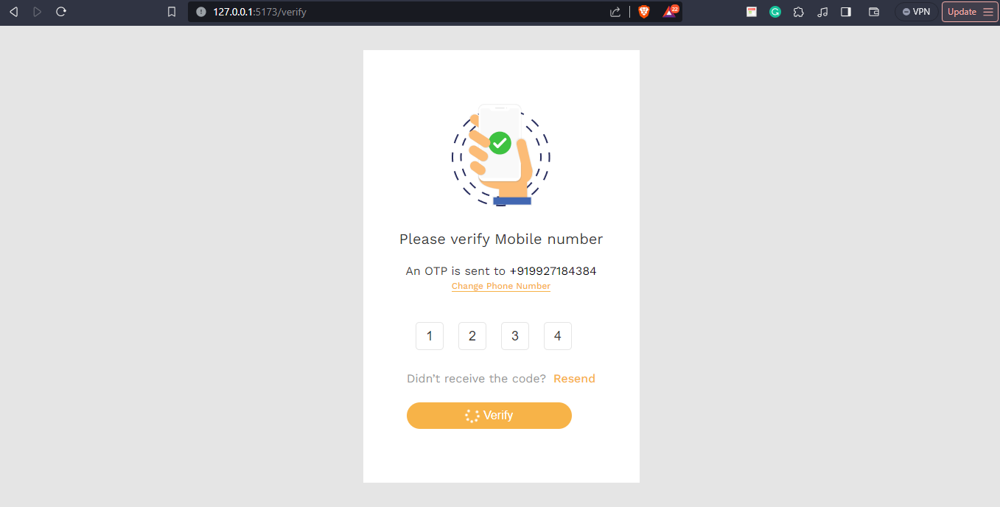
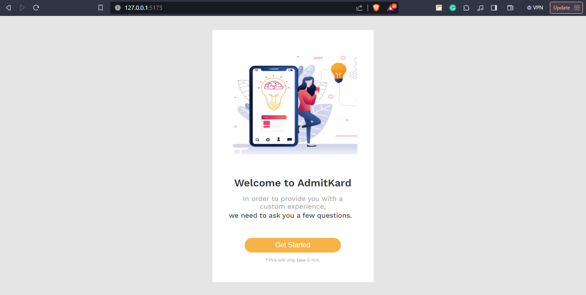

# clone project with => 
# npm i clone
# npm install => for both frontend and backend 

# create account on twilio
# Set Environmental Variables just replace => .envExample file to .env 

# DEMO IMAGES 

